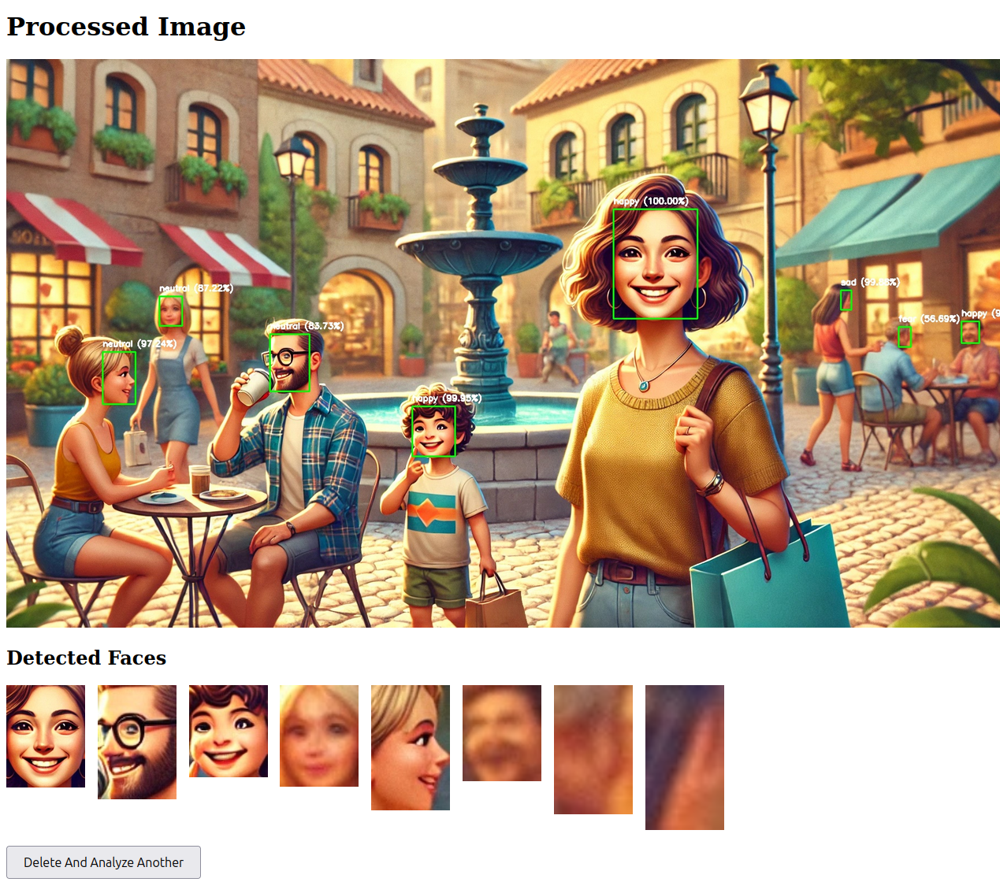

# vision_webapp_face_detection
## Vision webapp to detect and extract face
To run this webapp
1. Clone the reository.
2. Ensure the used python libtraries are set-up.
3. Navigate to the root folder of the repository
4. run 'python app.py'

